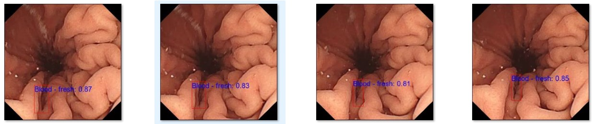

# PathologyDetection-WCE
Benchmarking and evaluating object detection models for pathology detection in Wireless Capsule Endoscopy (WCE) using the Kvasir-Capsule dataset and MMdetection framework.

This repository contains the setup and configuration files for the evaluation of object detection models on the Kvasir-Capsule dataset, converted to MS COCO format. The models evaluated include SSD, EfficientDet, Faster RCNN, RetinaNet, YOLOv3, RTMDet-S, RTMDet-Tiny, RTMDet-Medium, and Soft Teacher.
Below are some examples of detected images:

### Detected Image from video

<div align="center">
  
</div>
<div align="center">
  
</div>
## Detected Video

Below is an animated GIF showcasing the detected video results:


## Repository Structure

- `configs/`: Contains the configuration files for each model with modified parameters (input size, batch size, epoch size, learning rate, and class names).
- `data/`: Contains the Kvasir-Capsule dataset in its original and COCO format.
- `notebooks/`: Contains Jupyter notebooks for data exploration, model training, and evaluation.
- `results/`: Contains results including figures, learning curves, and evaluation metrics.
- `scripts/`: Contains shell scripts for training, evaluating models, and plotting learning curves.

## Getting Started

1. Clone the repository:
    git clone https://github.com/maya-tsedeke/PathologyDetection-WCE.git
    cd PathologyDetection-WCE
2. Follow the MMdetection installation instructions:
Please follow the official MMdetection [installation guide](https://github.com/open-mmlab/mmdetection/blob/master/docs/en/get_started.md#installation) to set up MMdetection. Ensure that you have all the dependencies installed and the environment properly configured.

3. Download and prepare the data:
Place the Kvasir-Capsule dataset in the `data/kvasir_capsule/` directory or change the path as per your storage location and convert it to COCO format.

## Training and Evaluation
For detailed instructions on training and testing models, please refer to the official MMdetection [training guide](https://github.com/open-mmlab/mmdetection/blob/master/docs/en/get_started.md#train-test-and-inference).

#### Important Note on Configuration File Paths

If you clone this repository inside the MMdetection repository, you will need to modify the `_base_` paths in the configuration files to reflect the new structure. For example, you should change:

```python
_base_ = [
 '../mmdetection/configs/rtmdet/rtmdet_s_8xb32-300e_coco.py',
 'PathologyDetection-WCE/kvasir_capsule__coco_detection',
]
```
### to
```python
_base_ = [
    'configs/rtmdet/rtmdet_s_8xb32-300e_coco.py',
    'PathologyDetection-WCE/configs/kvasir_capsule__coco_detection',
]
```
If you clone MMdetection and PathologyDetection-WCE independently, ensure the paths use ../mmdetection as shown in the original configuration files.

## Results
The results, including figures and evaluation metrics, can be found in the results/ directory.

## Code Repositories
The models were evaluated using the MMdetection repository. Some configuration files are derived from the MMdetection project and are used under the terms of its license. For more details, refer to the LICENSE file in mmdetection repo.

### Explanation

- **Installation Instructions**: Direct users to follow MMdetection's official installation instructions.
- **Training and Evaluation**: Instruct users to use the provided scripts and refer to MMdetection's official training guide for detailed steps.
- **Configuration File Paths**: Explain how to modify the `_base_` paths in configuration files if the repositories are cloned inside each other or independently.
- **General Information**: Include standard sections about results, code repositories, and licenses.

This README ensures that users are properly guided through the setup, training, and evaluation processes while being aware of necessary path modifications depending on their directory structure.
